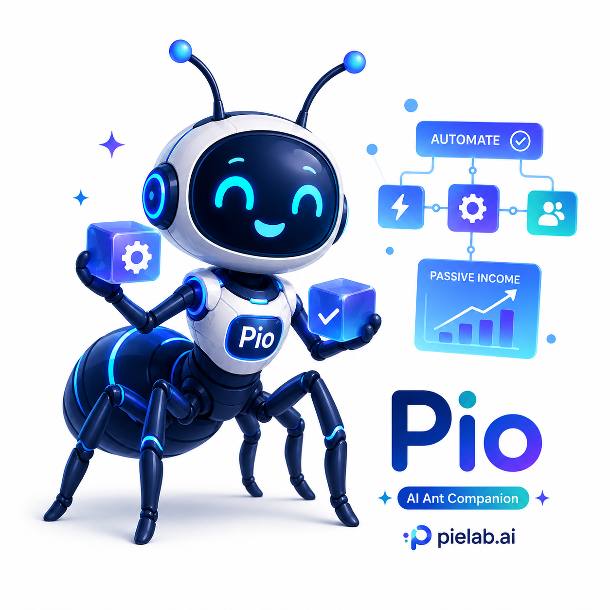

<p align="center">
  <a href="https://pielab.ai">
    
  </a>
</p>
<p align="center">
  <a href="https://discord.com/invite/3cU7Bz4UPx"></a>
</p>
<p align="center">
  Official domain: <a href="https://pielab.ai">pielab.ai</a>
</p>

> New issues and PRs from new contributors are auto-closed by default. Maintainers review auto-closed issues daily. See [CONTRIBUTING.md](CONTRIBUTING.md).

---

# pie-lab Mono Repo

`pie-lab` is a local-first Agentic Development Kit built from the `pi` source baseline and extended with 9router-derived routing, usage tracking, provider operations, and future `pie-chat` workflows.

<p align="center">
  
</p>
<p align="center">
  <strong>Pio</strong> is pie-lab's AI Ant Companion.
</p>

* **[@pie-lab/coding-agent](packages/coding-agent)**: Interactive coding agent CLI
* **[@pie-lab/agent-core](packages/agent)**: Agent runtime with tool calling and state management
* **[@pie-lab/ai](packages/ai)**: Unified multi-provider LLM API (OpenAI, Anthropic, Google, …)
* **[@pie-lab/router](packages/router)**: 9router-derived model routing, fallback, account selection, cooldown, and RTK token saver
* **[@pie-lab/storage](packages/storage)**: Provider connection, proxy pool, quota snapshot, and usage history storage
* **[@pie-lab/server](apps/server)**: Local OpenAI-compatible API server
* **[@pie-lab/dashboard](apps/dashboard)**: Usage, cost, quota, provider connection, and account selection dashboard
* **[@pie-lab/dashboard-next](apps/dashboard-next)**: Next.js 16 dashboard with shadcn/ui operations pages
* **[@pie-lab/pie-chat](apps/chat)**: Next.js Pie Chat UI and Telegram/Discord bridge extension

## pie-lab 이름의 의미

`pie-lab`은 기존 `pi` 소스를 기반으로 시작하지만, 이 통합 프로젝트에서 `pi`는 **Passive Income**을 의미합니다. `lab`은 router, dashboard, chat bridge, custom agent workflow를 계속 실험하고 다듬는 개인/팀용 작업실이라는 뜻으로 사용합니다.

여기서 Passive Income은 한국어로 흔히 말하는 **불로소득**에 가깝습니다. 다만 단순히 노력 없이 얻는 돈이라는 의미보다는, agent, 자동화, 도구, 반복 가능한 workflow를 통해 지속적인 수익 구조를 만들어가는 방향을 뜻합니다.

비슷한 표현으로 `unearned income`도 있지만, 이 표현은 세무나 법률 문맥에서 “노동의 직접 대가가 아닌 소득”을 가리키는 딱딱한 표현에 가깝습니다. `pie-lab`에서는 프로젝트의 방향성과 사용 경험을 더 잘 담는 표현으로 **Passive Income**을 사용합니다.

이 프로젝트는 처음에는 `pie-adk`라는 가칭으로 정리했지만, 실제 방향이 SDK 하나보다 CLI, router, dashboard, automation, chat bridge를 함께 실험하는 제품에 가까워졌기 때문에 `pie-lab`으로 이름을 변경했습니다. ADK는 이름이 아니라 설명으로 남깁니다.

CLI 실행 명령어와 앱 내부 이름은 모두 `pie`로 사용합니다. 기존 `pi` fork와 충돌하지 않도록 기본 설정 경로는 `~/.pie/agent`, 프로젝트 설정 경로는 `.pie/`, 환경변수는 `PIE_CODING_AGENT_DIR` 체계를 사용합니다.

## Pie Lab 대표 색상

Pie Lab의 대표 색상은 Pio 캐릭터와 터미널 가독성을 기준으로 **Pie Lab Blue + Cyan** 조합으로 정합니다.

- Primary Blue: `#2563EB`
- Deep Blue: `#1D4ED8`
- Cyan Accent: `#06B6D4`
- Mint Status: `#10B981`
- Slate Text: `#111827` / `#E2E8F0`

CLI 시작 헤더는 이 팔레트를 기준으로 라이트/다크 터미널을 감지해 더 읽기 쉬운 색을 사용하고, 터미널 폭에 맞춰 박스 크기를 자동 조정합니다. Dashboard, Pie Chat, 문서 이미지도 앞으로 이 색상 체계를 기준으로 맞춥니다.

To learn more about pi:

* [Visit pielab.ai](https://pielab.ai), the project website with demos
* [Read the documentation](https://pielab.ai/docs/latest), but you can also ask the agent to explain itself

## Share your OSS coding agent sessions

If you use pi or other coding agents for open source work, please share your sessions.

Public OSS session data helps improve coding agents with real-world tasks, tool use, failures, and fixes instead of toy benchmarks.

For the full explanation, see [this post on X](https://x.com/badlogicgames/status/2037811643774652911).

To publish sessions, use [`badlogic/pi-share-hf`](https://github.com/badlogic/pi-share-hf). Read its README.md for setup instructions. All you need is a Hugging Face account, the Hugging Face CLI, and `pi-share-hf`.

You can also watch [this video](https://x.com/badlogicgames/status/2041151967695634619), where I show how I publish my `pi-mono` sessions.

I regularly publish my own `pi-mono` work sessions here:

- [badlogicgames/pi-mono on Hugging Face](https://huggingface.co/datasets/badlogicgames/pi-mono)

## All Packages

| Package | Description |
|---------|-------------|
| **[@pie-lab/ai](packages/ai)** | Unified multi-provider LLM API (OpenAI, Anthropic, Google, etc.) |
| **[@pie-lab/agent-core](packages/agent)** | Agent runtime with tool calling and state management |
| **[@pie-lab/coding-agent](packages/coding-agent)** | Interactive coding agent CLI |
| **[@pie-lab/router](packages/router)** | 9router-derived routing, fallback, account selection, cooldown, and RTK token saver |
| **[@pie-lab/storage](packages/storage)** | Provider connection, quota snapshot, proxy pool, and usage history storage |
| **[@pie-lab/tui](packages/tui)** | Terminal UI library with differential rendering |
| **[@pie-lab/web-ui](packages/web-ui)** | Web components for AI chat interfaces |

## pie-lab 통합 상태

현재 `pie-lab`은 `pi` 소스를 baseline으로 두고, `9router`의 핵심 기능을 server/router/dashboard/storage 경계에 흡수하는 방향으로 구현 중입니다.

구현된 흐름:

- `/v1/chat/completions` non-stream 및 streaming/SSE
- router alias, fallback route plan, account selection, quota-aware selection
- provider connection/proxy pool/model cooldown 관리 API
- fallback chain/combo policy, alias/intent mapping 관리 API와 dashboard preview
- usage/cost dashboard, request detail/fallback timeline, account selection 이유 표시
- OAuth token import wizard와 browser redirect login, quota/budget 설정, provider health dashboard와 deep probe
- `/budget` 상태 조회와 chat/media 요청의 budget limit enforcement
- RTK token saver usage 기록
- media alias, `extra_body` passthrough, Cohere/Ollama/ElevenLabs coverage를 포함한 `/v1/embeddings`, `/v1/search`, `/v1/web/fetch`, `/v1/audio/speech`, `/v1/audio/transcriptions`, `/v1/images/generations`
- Next.js dashboard에서 usage origin/endpoint 집계, budget form, proxy pool 수정/삭제/binding, media endpoint test form 제공
- Pie Chat 웹 요청은 `pie-chat:web`, Telegram/Discord bridge 요청은 `pie-chat:telegram`/`pie-chat:discord` origin으로 usage/cost 기록

`pie-chat` is based on the existing [jikime/pi-chat](https://github.com/jikime/pi-chat) source and routed through pie-lab.

## Installation

The official npm package for the CLI is `@pie-lab/coding-agent`. It installs the `pie` command:

```bash
npm install -g --ignore-scripts @pie-lab/coding-agent
pie
```

Local development commands:

```bash
npm --workspace @pie-lab/server run dev          # http://127.0.0.1:4873
npm --workspace @pie-lab/dashboard-next run dev  # http://127.0.0.1:4876
npm --workspace @pie-lab/pie-chat run dev        # http://127.0.0.1:4877
pie -e apps/chat                                 # Telegram/Discord bridge
```

## Contributing

See [CONTRIBUTING.md](CONTRIBUTING.md) for contribution guidelines and [AGENTS.md](AGENTS.md) for project-specific rules (for both humans and agents).

## Development

pie-lab requires Node.js `>=22.19.0`. If your local Node is older, switch first:

```bash
nvm install
nvm use
```

```bash
npm install          # Install all dependencies
npm run build        # Build all packages
npm run check        # Lint, format, and type check
./test.sh            # Run tests (skips LLM-dependent tests without API keys)
./pie-test.sh        # Run pie from sources (can be run from any directory)
```

> **Note:** `npm run check` requires `npm run build` to be run first. The web-ui package uses `tsc` which needs compiled `.d.ts` files from dependencies.

## License

MIT
# pie-lab
